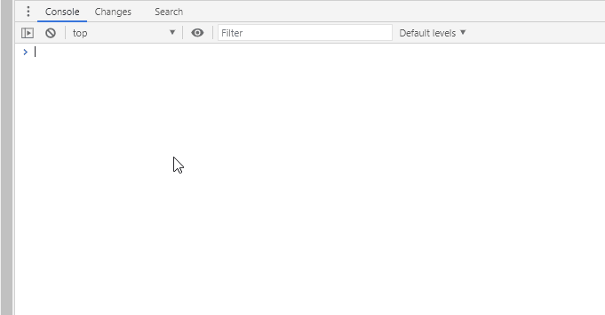

# A simple Hello World Plugin
This is the 'hello world' plugin to show how simple it is to create plugins with **redevtools**





```typescript
/**
* Author: Buglink.com Team
* URL: https://github.com/redevtools/redevtools/plugins/hello 
*/
(async (re) => {
        async function hello(name: string) {
            console.log("hello " + name)
        }
        re.hello = hello
        re.hello.version = "1.0"
    }
)(window.re);

```

Plugins are written in **TypeScript** or JavaScript.

Each plugin includes a README.md file that describes what the plugin does and a 
`preview.gif` file as a preview of the plugin in action. We suggest to use animated 
gif files to show the plugin in action.

## Publish a plugin

To publish a plugin make a pull request with the plugin files directly to this repository.

The plugin will be evaluated and possibly included in the official plugins.
