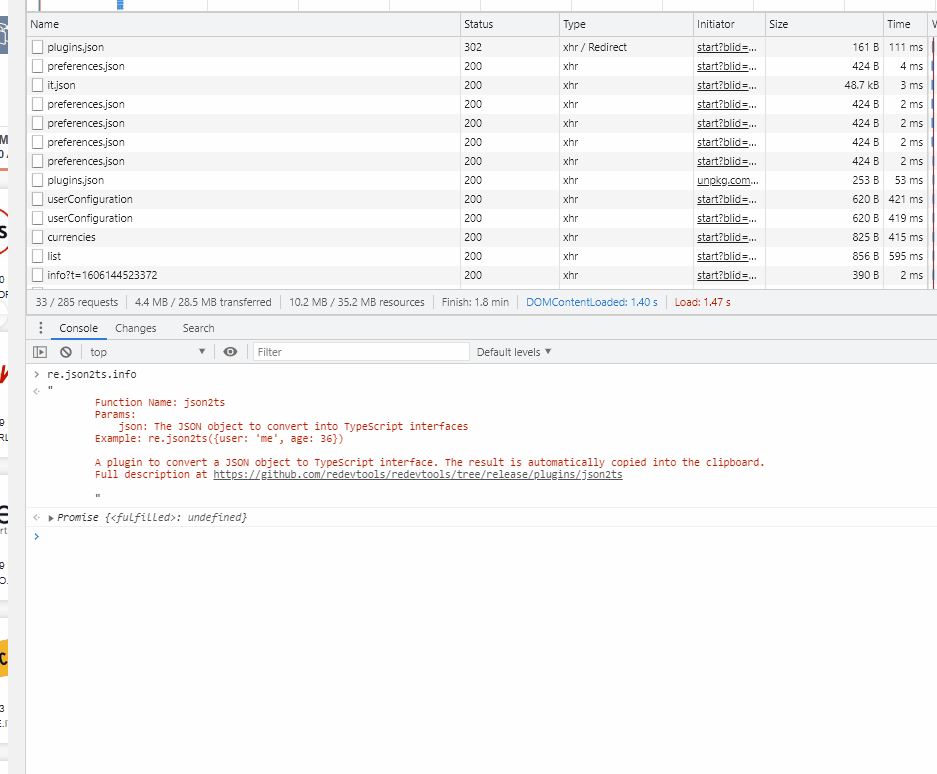

# A plugin to convert json data to TypeScipt interfaces directly from the console
A plugin to convert a JSON object to TypeScript interfaces. 

Just type `re.json2ts(yourJsonData)` and it will print the json and copy it into the clipboard.

The result is **automatically copied** into the clipboard, ready to be pasted into your IDE.

## Use case: JSON response to TypeScript interfaces
Often the developer need to extract the interfaces from a backend response.

You can do this by:

1) Click on the request in the **Network panel**
2) Right click on the response (in the **Preview** tab)
3) Select **Store as variable** from the menu
4) type `re.json2ts(temp1)` into the console

## Thanks to Gregor Biswanger

Code adapted from https://github.com/GregorBiswanger/json2ts

