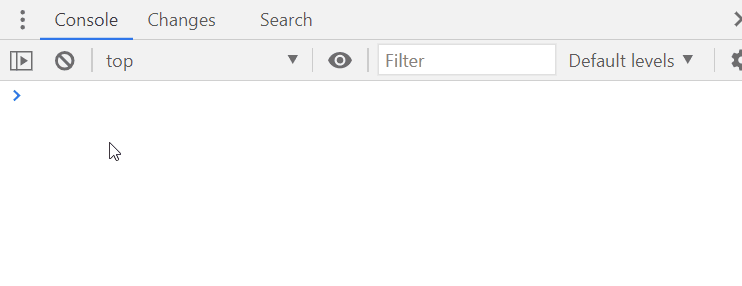

# A plugin to convert a jwt token to json directly from the console
A plugin to decode a JWT token to a JSON object. 

Just type `re.jwtDecode(yourJsonData)` and it will print the json and copy it into the clipboard.

More at [jwtDecode – How to decode a JWT token… from the console](https://www.redevtools.com/blog/jwtdecode-how-to-decode-a-jwt-token-from-the-console/)