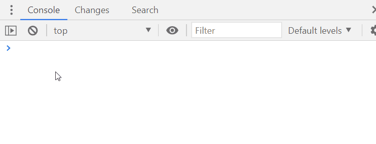

# A plugin to make it easy to apply tailwind classes directly from your browser

Just type `re.tailwind()` and it will add a small tailwind-link icon to any element having a tailwind class already.
Click the icon to edit the classes using the Tailwind Devtool and see changes instantly. 

To enable Tailwind ReDevtool automatically, add it to your init method:

`redevtool.init("tailwind")`

More at [todo](https://www.redevtools.com/blog/)